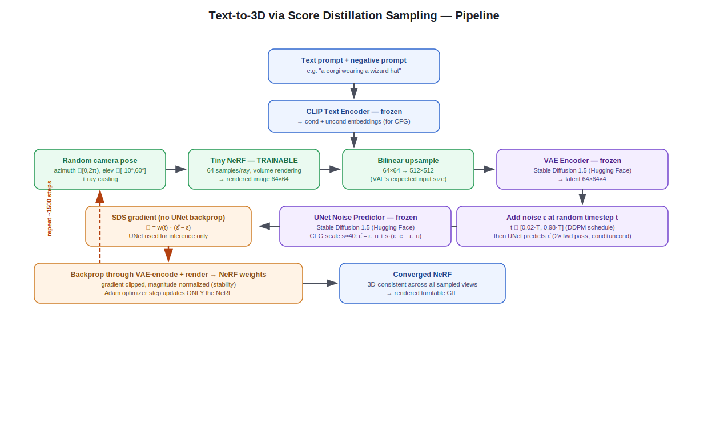

# Few-Shot Text-to-3D Generation via Score Distillation Sampling (SDS)

> **Status:** Active Research Project (Work in Progress)

An educational, from-scratch implementation of **Score Distillation Sampling (SDS)** for text-to-3D generation using a **frozen pretrained 2D diffusion model** as supervision.

This project aims to reproduce the core concepts introduced in **DreamFusion** while remaining lightweight enough to run on a **single NVIDIA T4 GPU (16GB)**. Beyond reproduction, the repository serves as an ongoing research platform for experimenting with improved optimization strategies, view consistency, and efficient 3D representations.

---

## Overview

Traditional 3D generative models rely on large-scale 3D datasets, which are expensive to collect and limited in diversity. In contrast, this project leverages the rich visual knowledge embedded within pretrained text-to-image diffusion models to optimize a neural 3D representation directly from text prompts.

Only the NeRF (~a few hundred thousand parameters, positional-encoding MLP) is optimized during training. Stable Diffusion 1.5 (`stable-diffusion-v1-5/stable-diffusion-v1-5` on Hugging Face) remains completely frozen and acts as a guidance network through Score Distillation Sampling — its weights receive zero gradient updates throughout training.

---

# Pipeline

<p align="center">
    
</p>

<p align="center">
<b>Figure.</b> End-to-end Score Distillation Sampling (SDS) optimization pipeline. A text prompt is encoded once, while a differentiable NeRF is optimized using supervision from a frozen Stable Diffusion model.
</p>

---

# Features

## Features

- ✅ Tiny NeRF from scratch (positional-encoding MLP, σ + RGB heads)
- ✅ Differentiable volume rendering (64 stratified samples/ray, white-background compositing)
- ✅ Score Distillation Sampling: `∇ = w(t)·(ε̂ − ε)`, no backprop through the UNet
- ✅ Stable Diffusion 1.5 guidance (VAE encoder + UNet, both frozen)
- ✅ Classifier-Free Guidance: `ε̂ = ε_uncond + s·(ε_cond − ε_uncond)`, s ≈ 25
- ✅ Random camera sampling (azimuth ∈ [0, 2π), elevation ∈ [−10°, 60°])
- ✅ Mixed-precision inference (fp16 for SD components, fp32 for NeRF)
- ✅ Gradient norm clipping (max norm 1.0)
- ✅ Gradient magnitude normalization (rescale raw SDS gradient to unit mean-abs before backprop)
- ✅ Kaggle T4-compatible (fits within 16GB at 64×64 NeRF / 512×512 guidance resolution)

## Planned

- 📌 Mesh extraction (marching cubes → `.obj`/`.ply`)
- 📌 Normal-smoothness loss (penalize non-smooth surface normals)
- 📌 Orientation loss (discourage flat "billboard" geometry)
- 📌 Multi-view diffusion guidance (MVDream / Zero-1-to-3 in place of plain SD 1.5)
- 📌 3D Gaussian Splatting backend (replacing the NeRF representation)
- 📌 Comprehensive ablation studies (resolution, guidance scale, representation)

---

# Method Overview

The optimization follows the standard Score Distillation Sampling framework, with the exact tensor shapes and formulas at each step below.

```
                Text prompt (e.g. "a corgi wearing a wizard hat")
                     │
                     ▼
        Frozen CLIP Text Encoder (SD 1.5 tokenizer + encoder)
                     │
                     ▼
     Cond + uncond text embeddings, concatenated for CFG
                     │
                     ▼
     Random camera pose: azimuth∈[0,2π), elevation∈[-10°,60°]
                     │
                     ▼
        Tiny NeRF (TRAINABLE) — render at 64×64,
        64 stratified samples/ray, white-bg compositing
                     │
                     ▼
     Rendered RGB image, bilinearly upsampled to 512×512
                     │
                     ▼
       Frozen VAE encoder → latent 64×64×4
                     │
                     ▼
     Add noise ε at random timestep t ∈ [0.02T, 0.98T]
                     │
                     ▼
     Frozen UNet predicts ε̂ (2 fwd passes: cond + uncond)
                     │
                     ▼
     CFG combine: ε̂ = ε_uncond + 25·(ε_cond − ε_uncond)
                     │
                     ▼
     SDS gradient: ∇ = w(t)·(ε̂ − ε), magnitude-normalized
                     │
                     ▼
     Backprop through VAE-encode + render (NOT through UNet)
                     │
                     ▼
     Adam step (lr=2e-3, grad-clip norm 1.0) — NeRF weights only
```

At every optimization step:

1. A random camera pose is sampled on a partial sphere around the origin.
2. The current NeRF is rendered from that viewpoint at 64×64.
3. The render is upsampled to 512×512 and encoded into the SD 1.5 latent space (64×64×4).
4. Gaussian noise is added at a randomly selected timestep `t`.
5. The frozen UNet predicts the noise residual, combined via classifier-free guidance.
6. The SDS gradient `w(t)·(ε̂ − ε)` is computed, magnitude-normalized, and used as a fixed target for a standard MSE loss trick — no gradient flows through the UNet itself.
7. Only the NeRF's parameters are updated via Adam, with gradient-norm clipping.

No part of Stable Diffusion is fine-tuned during training — it is called for inference only, twice per step (conditional + unconditional pass).

---

# Implementation Details

## Trainable Component

| Component | Details | Status |
|-----------|---------|--------|
| Tiny NeRF | Positional-encoding MLP (10 frequency bands), 3 hidden layers × 128 units, separate σ/RGB heads | ✅ Trainable |

---

## Frozen Components

| Component | Source | Role |
|-----------|--------|------|
| CLIP Text Encoder | `stable-diffusion-v1-5/stable-diffusion-v1-5` (Hugging Face) | Encodes prompt + negative prompt once per run |
| VAE Encoder | same checkpoint | Maps rendered RGB (512×512) → latent (64×64×4) every step |
| UNet | same checkpoint | Predicts noise residual `ε̂`, called twice/step (cond + uncond) |
| DDPM Scheduler | same checkpoint | Defines the noise schedule `ᾱ_t` used for both adding noise and the SDS weight `w(t)` |

---

## Rendering

- Differentiable volume rendering: alpha compositing over 64 stratified samples per ray, near/far bounds set around the unit sphere
- Random camera pose sampling: azimuth ∈ [0, 2π), elevation ∈ [−10°, 60°], fixed radius
- White background compositing for low-accumulated-density rays (discourages low-opacity haze filling the volume)
- Low-resolution NeRF rendering (64×64) for compute efficiency, upsampled before being shown to the diffusion model
- High-resolution diffusion guidance (512×512 — SD 1.5's expected VAE input size)

---

## Optimization

- Score Distillation Sampling: `∇_θ L = E_{t,ε}[w(t)·(ε̂ − ε)·∂x/∂θ]`, no UNet backprop
- Classifier-Free Guidance, scale s ≈ 25 (well above typical 2D-generation CFG ~7.5, needed to escape blurry early-training solutions)
- Adam optimizer, lr = 2e-3
- Gradient norm clipping, max norm 1.0
- Gradient magnitude normalization (raw SDS gradient rescaled to unit mean-abs magnitude before backprop — added after early runs collapsed to a flat, degenerate single-color NeRF without it)
- Mixed precision: fp16 for all Stable Diffusion components, fp32 for the NeRF
- Random timestep sampling per step, restricted to `t ∈ [0.02T, 0.98T]`

---

# Training Configuration

| Setting | Value |
|----------|-------|
| Base Model | Stable Diffusion v1.5 (`stable-diffusion-v1-5/stable-diffusion-v1-5`) |
| GPU | NVIDIA T4 (16GB) |
| Framework | PyTorch + Hugging Face `diffusers` |
| Render Resolution | 64×64 |
| Guidance Resolution | 512×512 |
| Samples per Ray | 64 |
| Optimizer | Adam |
| Learning Rate | 2e-3 |
| Guidance Scale | 25 |
| Gradient Clip (max norm) | 1.0 |
| Precision | FP16 (Diffusion), FP32 (NeRF) |
| Batch Size | 1 |
| Iterations | 1500 |
| Platform | Kaggle |

---

# Current Progress

The repository is under active development.

### Completed

- [x] Tiny NeRF implementation (positional encoding + MLP)
- [x] Differentiable volume renderer
- [x] Stable Diffusion 1.5 integration (VAE + UNet + CLIP, frozen)
- [x] Score Distillation Sampling loss
- [x] Classifier-Free Guidance
- [x] Random camera sampling
- [x] Full training pipeline (Kaggle T4-compatible)
- [x] Gradient stabilization (clipping + magnitude normalization — fixes a reproducible flat-color collapse failure mode)

### Currently Working On

- [ ] View-dependent prompting (direct fix for the Janus/multi-face problem)
- [ ] Further optimization stability tuning (camera/timestep sampling distributions)
- [ ] Multi-view consistency improvements
- [ ] Janus-artifact frequency measurement (baseline, pre-fix)
- [ ] Camera pose sampling refinement

---

# Roadmap

## Phase 1 — Baseline SDS

- [x] Tiny NeRF
- [x] Volume rendering
- [x] Stable Diffusion guidance
- [x] SDS optimization
- [x] CFG implementation

---

## Phase 2 — Stability Improvements

- [x] Gradient clipping
- [x] Gradient magnitude normalization
- [ ] Adaptive timestep sampling
- [ ] Better camera sampling distribution
- [ ] Background/density regularization

---

## Phase 3 — Geometry Improvements

- [ ] View-dependent prompting (highest priority — direct Janus-problem mitigation)
- [ ] Orientation loss
- [ ] Normal-smoothness loss
- [ ] Empty-space regularization
- [ ] Density regularization

---

## Phase 4 — Mesh Generation

- [ ] Marching Cubes over the density field
- [ ] OBJ export
- [ ] PLY export
- [ ] Mesh refinement/cleanup

---

## Phase 5 — Research Extensions

- [ ] Multi-view diffusion priors (replace plain SD 1.5)
- [ ] MVDream integration
- [ ] Zero-1-to-3 comparison
- [ ] 3D Gaussian Splatting backend (replacing NeRF)
- [ ] Quantitative evaluation (CLIP similarity, Janus-frequency, etc.)
- [ ] Ablation studies (resolution, guidance scale, representation)
- [ ] Runtime/memory benchmarking

---

# Results

🚧 **No results have been measured yet — this project is at the training-pipeline-verification stage.**
The categories below are what will be reported once runs are complete, not
placeholders for numbers already obtained:

- Training visualizations (loss curves, preview renders per step)
- Multi-view turntable renderings
- Camera trajectory videos
- Extracted meshes (once mesh export is implemented)
- Quantitative comparisons (CLIP similarity, with vs. without view-dependent prompting)
- Ablation study results
- Runtime analysis (wall-clock per 1000 steps on T4)
- Memory consumption benchmarks

---

# References

1. **Poole, B., Jain, A., Barron, J. T., & Mildenhall, B.**
   *DreamFusion: Text-to-3D using 2D Diffusion.*
   arXiv, 2022.

2. **Mildenhall, B., et al.**
   *NeRF: Representing Scenes as Neural Radiance Fields for View Synthesis.*
   ECCV, 2020.

3. **Rombach, R., et al.**
   *High-Resolution Image Synthesis with Latent Diffusion Models.*
   CVPR, 2022.

4. **Shi, Y., et al.**
   *MVDream: Multi-view Diffusion for 3D Generation.*
   arXiv, 2023.

5. **Lin, C., et al.**
   *Magic3D: High-Resolution Text-to-3D Content Creation.*
   CVPR, 2023.

6. **Tang, J., et al.**
   *DreamGaussian: Generative Gaussian Splatting for Efficient 3D Content Creation.*
   ICLR, 2024.

---

# Acknowledgements

This project is inspired by the DreamFusion family of methods and aims to provide a lightweight, educational, and extensible implementation for studying Score Distillation Sampling under limited computational resources.

---

## Project Status

> 🚧 **Active Research Repository**
>
> The implementation is continuously evolving. Features, APIs, and training strategies may change as new experiments and improvements are integrated. Contributions, discussions, and suggestions are welcome.
